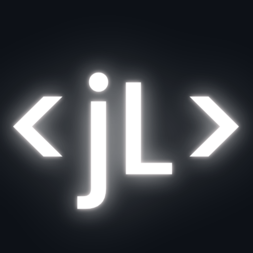
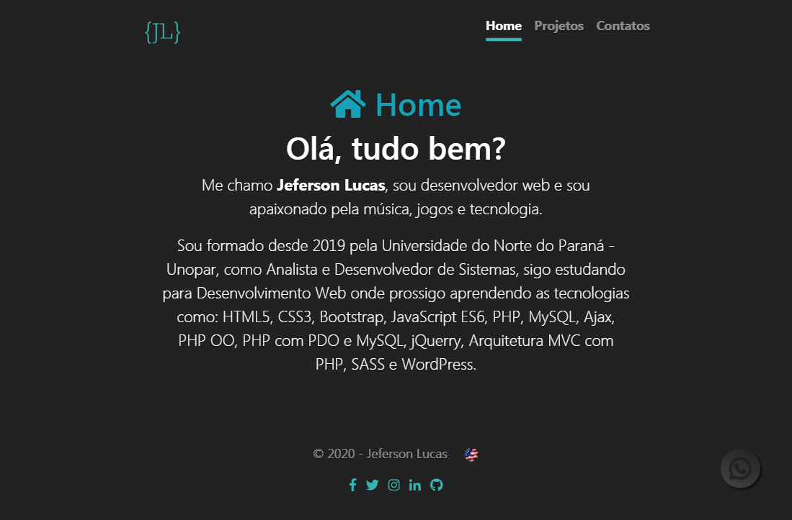
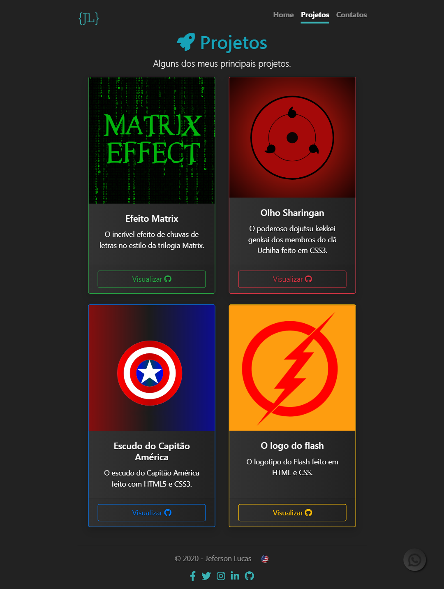
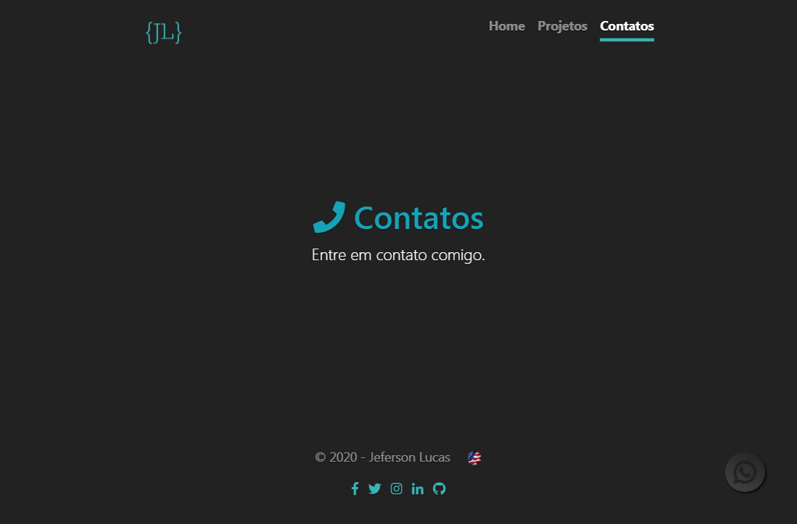

	
	<h1 align="center">My portfolio</h1>
	
My simple portfolio

	

    	
    	
  	

	

	

	

## Translations

* [Original](https://github.com/JefersonLucas/my-portfolio/blob/master/README.md)
* [English](https://github.com/JefersonLucas/my-portfolio/blob/master/translate/en/README.md)

## Built with

* [Bootstrap](https://getbootstrap.com/) - Framework front end.
* [Font Awesome](https://fontawesome.com/) - Icon pack Framework.

## Authors

* [@JefersonLucas](https://github.com/JefersonLucas) - _Creator_.

See also the complete list of [contributors](https://github.com/JefersonLucas/my-portfolio/contributors) who participated in this project.

## License

This project is licensed under the license MIT - see the file [LICENSE.md](https://github.com/JefersonLucas/my-portfolio/blob/master/LICENSE) for details.

## Thanks

My sincere thanks:

* God.
* Project contributors.
* Everyone who visits the project and leaves a star as recognition.
